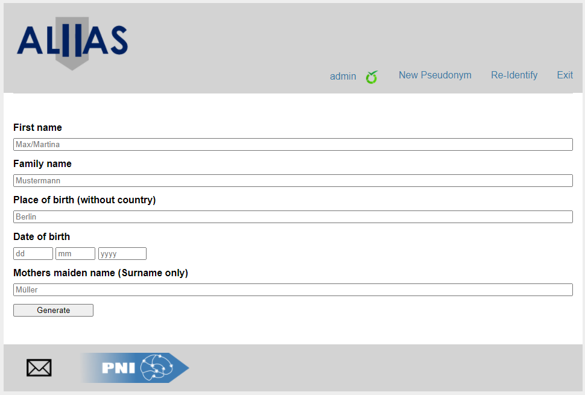
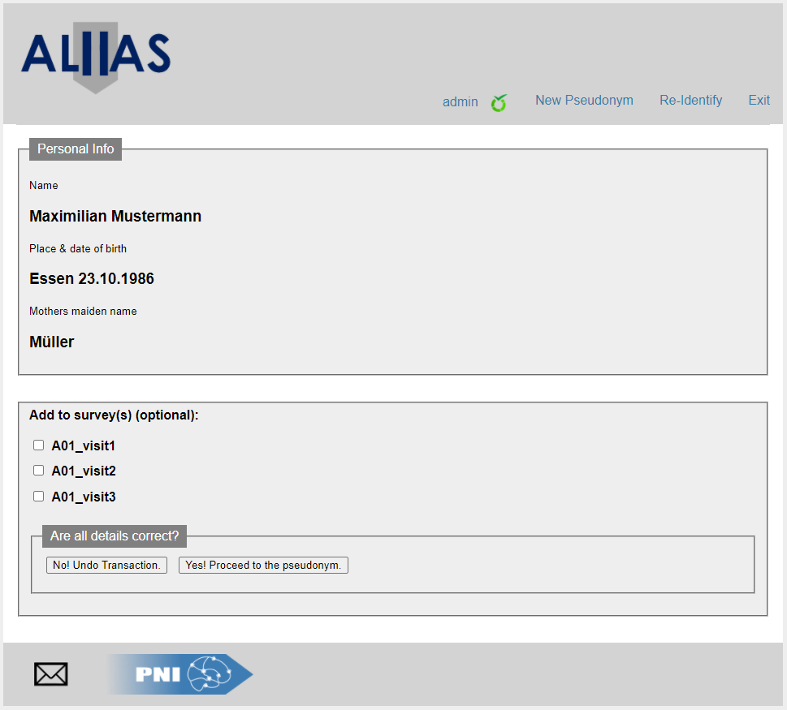
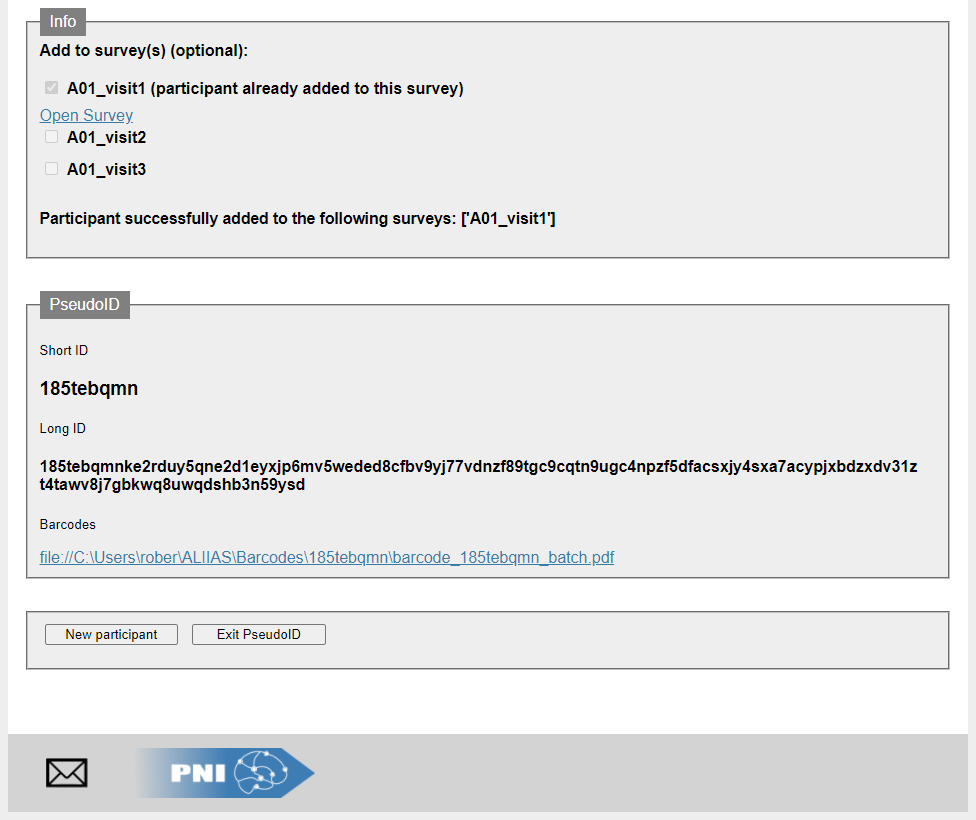

## Anonymization with LimeSurvey integration and II-factor Authentication for Scientific research

We introduce **ALIIAS**, a customizable pseudonymization framework that allows easy and flexible deployment of pseudonymization software!
Features include:
* custom-format pseudonyms
* two-factor authentication
* LimeSurvey integration
* Barcode generation
* support for hardware security tokens
* no need for a trusted-third-party
* compatibilty with a wide variety of research infrastructures

### Demo Version
We provide a [demo version](https://github.com/pni-lab/ALIIAS/releases) of the software, which works without the need of an physical hardware security toke. Simply unpack the zip and make sure that the .exe file and the settings.conf file are in the same folder, no installation needed. After starting the ALIIAS.exe, the software will open your systems default browser to start the pseudonymization process!

To access the LimeSurvey features, we provide the following login credentials:
username: testuser
password: testuser

In the following link using the same credentials, you can check if your participant has been succesfully added to the test questionnaire:
https://www.uni-due.de/~ht2203/limesurvey/index.php/admin/index

### User Interface

## 

## 

## 

### Citation

*Englert, Robert and Schedlowski, Manfred and Engler, Harald and Rief, Winfried and Büchel, Christian and Bingel, Ulrike and Spisak, Tamas, ALIIAS: Anonymization with LimeSurvey Integration and II-Factor Authentication for Scientific Research. Available at SSRN: https://ssrn.com/abstract=4089108 or http://dx.doi.org/10.2139/ssrn.4089108*

